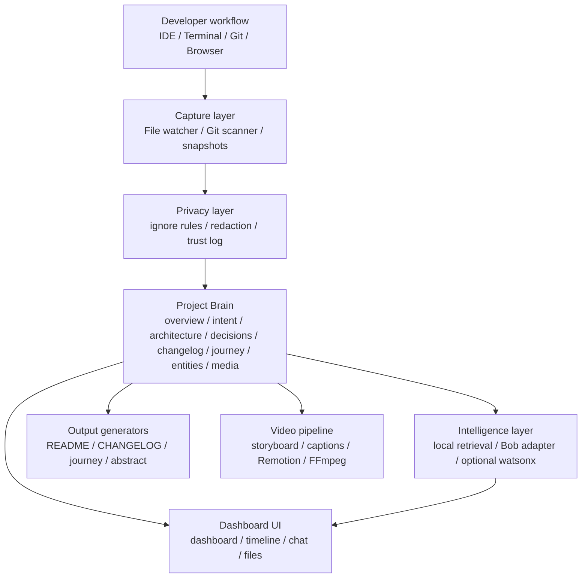
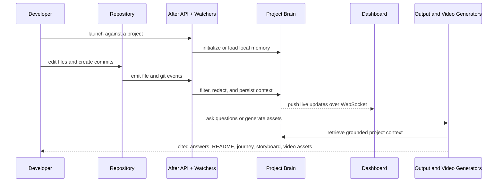

# IBM-Bob / After MVP

<div align="center">

### Local-first developer memory, grounded project intelligence, and polished demo generation

<p>
  
  
  
  
</p>

</div>

After MVP is a hybrid developer tool that captures meaningful engineering activity, stores it in a structured local "Project Brain", and turns that memory into technical outputs that are actually presentation-ready.

It works offline by default, integrates with Bob when available, and can optionally upgrade to IBM watsonx.ai and IBM Text to Speech for richer chat, generation, and narration.

## Why this project exists

Most teams build valuable context every day, then lose it across commits, chat, terminal history, screenshots, and half-finished notes. After is designed to keep that context alive and reusable.

With this repo, you can:

- capture repository changes and milestones into a local Project Brain
- ask grounded questions about the project with citations
- generate README, changelog, journey, and abstract outputs
- render a demo package from real project context instead of hand-written scripts
- preserve privacy with local-first storage, ignore rules, redaction, and audit logging

## What is implemented

| Area | Current capability |
| --- | --- |
| Capture | File watching, git activity capture, manual snapshots, event bus |
| Memory | Structured brain files such as `overview.md`, `journey.md`, `decisions.md`, `media.json` |
| Intelligence | Local retrieval-first chat, citation building, Bob Shell adapter, optional IBM Pro augmentation |
| Outputs | Generated README, changelog, journey report, and HTML abstract |
| Demo pipeline | Storyboard generation, caption generation, Remotion scenes, FFmpeg-based rendering plan |
| UI | Dashboard, timeline, chat, files view, real-time updates over WebSocket |
| Privacy | Ignore parsing, redaction, trust logging, local-first boundaries |

## Architecture



## Demonstration flow

The strongest demo for this project is not a slide deck. It is the repo itself being observed, remembered, and transformed into artifacts.



## Operating modes

| Mode | What it uses | What you get |
| --- | --- | --- |
| Local mode | Project Brain, retrieval, templates | Offline-first chat and output generation |
| Bob mode | Local mode plus Bob Shell | Better code-aware responses when Bob is available |
| IBM Pro mode | Local mode plus IBM watsonx.ai and IBM TTS | Enhanced generation quality and optional narration |

IBM services are progressive enhancement, not a hard dependency. The core product remains usable without cloud credentials.

## Quick start

### 1. Run the product

```bash
cd after-mvp
npm install
npm run launch
```

Open `http://localhost:3000`.

The `launch` script builds the workspace, initializes a Project Brain if needed, starts the API, serves the dashboard, and enables live repository watching.

### 2. Initialize another repo explicitly

```bash
cd after-mvp
npm run build
node packages/server/dist/index.js init ../your-project
node packages/server/dist/index.js start ../your-project --watch
```

### 3. Enable IBM Pro mode optionally

```bash
cd after-mvp
copy .env.example .env
```

Fill in the IBM credentials in `.env`, then restart the server. The current environment template supports:

- watsonx.ai
- IBM Text to Speech
- Cloudant placeholders
- NLU placeholders
- optional Bob Shell path configuration

For setup details, see:

- [Manual env setup](after-mvp/MANUAL_ENV_SETUP.md)
- [Environment template](after-mvp/.env.example)

## Suggested 5-minute demo

1. Start the app with `npm run launch` inside [after-mvp](after-mvp).
2. Open the dashboard and confirm project status and live connectivity.
3. Make a file change or commit in the connected repository.
4. Watch the timeline update automatically through WebSocket events.
5. Use chat or the REST API to ask what changed and why.
6. Generate a README, journey report, or storyboard from stored project context.

## Judging criteria alignment

| Criterion | How this repo addresses it |
| --- | --- |
| Completeness and feasibility | Working monorepo with API, dashboard, capture pipeline, Project Brain, generators, and video artifacts rather than a slide-only concept |
| Creativity and innovation | Combines local developer memory, grounded citations, automated artifact generation, and demo-video preparation in one workflow |
| Design and usability | Clean multi-screen dashboard with timeline, chat, and generated files views designed for fast operator understanding |
| Effectiveness and efficiency | Local-first by default for quick adoption, optional IBM enhancement for stronger AI output quality, and architecture that scales by package and workflow layer |

### IBM technology fit

- `watsonx.ai` enhances grounded chat and output generation when configured.
- `IBM Text to Speech` adds professional narration to generated demo assets.
- The integration is optional by design, which keeps the proof of concept feasible while still showing a clear IBM expansion path.

## Key API surface

Once the server is running on port `3000`, these endpoints provide the main experience:

```bash
curl http://localhost:3000/api/health
curl http://localhost:3000/api/bob/status
curl "http://localhost:3000/api/bob/search?q=project+brain"
curl http://localhost:3000/api/bob/events
curl -X POST http://localhost:3000/api/bob/readme
curl -X POST http://localhost:3000/api/bob/journey
curl http://localhost:3000/api/bob/video/status
curl -X POST http://localhost:3000/api/bob/video/render
```

Optional IBM-enhanced routes:

```bash
curl http://localhost:3000/api/bob/ibm/status
curl -X POST http://localhost:3000/api/bob/ibm/chat -H "Content-Type: application/json" -d "{\"query\":\"Summarize this project\"}"
curl -X POST http://localhost:3000/api/bob/ibm/narration -H "Content-Type: application/json" -d "{\"script\":\"Welcome to After MVP\"}"
```

## Repository map

```text
IBM-Bob/
|-- after-mvp/
|   |-- apps/ui/                 React dashboard
|   |-- packages/core/           capture, memory, privacy, intelligence
|   |-- packages/server/         Express API, CLI, WebSocket server
|   |-- packages/outputs/        README, changelog, journey, abstract generators
|   |-- packages/video/          storyboard, captions, render planning, video rendering
|   |-- packages/ui/             shared UI primitives
|   |-- .env.example             optional IBM Pro configuration template
|   `-- README.md                workspace quick reference
|-- LICENSE
`-- README.md                    repository overview
```

## Workspace quality signals

| Signal | Status |
| --- | --- |
| Monorepo | Turborepo workspace with app and package boundaries |
| Backend | TypeScript + Express + WebSocket |
| Frontend | React 19 + Vite + Zustand + Tailwind |
| Video | Remotion + FFmpeg pipeline |
| Templating | Handlebars-based output generators |
| Test coverage | Jest and Vitest suites exist across core, video, outputs, server, and UI packages |
| Runtime stance | Local-first by default, IBM-enhanced when configured |

## Technical stack

- `Node.js`, `TypeScript`, `Turborepo`
- `React 19`, `Vite`, `Zustand`, `Tailwind CSS`, `Radix UI`
- `Express`, `ws`, `commander`, `dotenv`
- `Remotion`, `FFmpeg`
- `Handlebars` for generated technical outputs
- IBM `watsonx.ai` and `Text to Speech` as optional enhancements

## Documentation map

- [after-mvp/README.md](after-mvp/README.md): workspace overview
- [after-mvp/MANUAL_ENV_SETUP.md](after-mvp/MANUAL_ENV_SETUP.md): IBM environment setup
- [after-mvp/bob_sessions](after-mvp/bob_sessions): sample Bob session captures and screenshots

## Build and validation

```bash
cd after-mvp
npm run check-types
npm run build
npm run lint
npm run test
```

## Project position in one sentence

After MVP turns raw development activity into a privacy-aware, memory-grounded, technically credible narrative that can power both day-to-day understanding and polished external demos.
